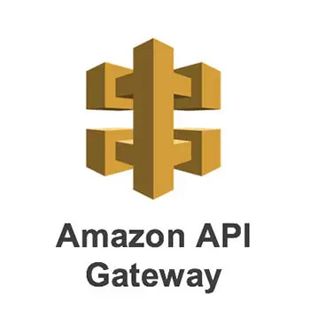
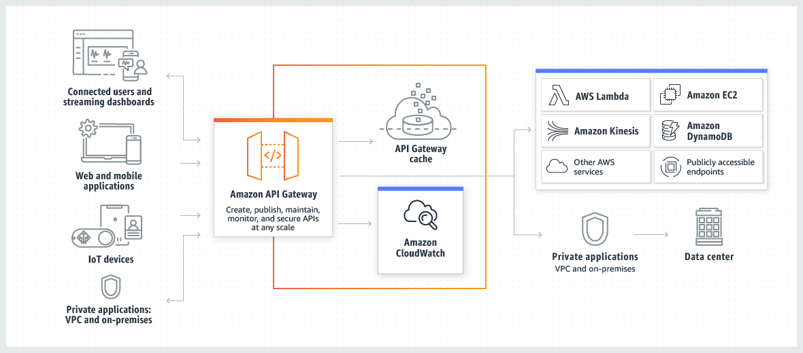

<div align="center">
  
</div>

## Description

Amazon API Gateway is an AWS service for creating, publishing, maintaining, monitoring, and securing REST, HTTP, and WebSocket APIs at any scale. API developers can create APIs that access AWS or other web services, as well as data stored in the AWS Cloud. As an API Gateway API developer, you can create APIs for use in your own client applications.

## Architecture



## Features of AWS API Gateway

✔ AWS Lambda + API Gateway = No infrastructure to manage
✔ Support for the WebSocket Protocol
✔ Handle API versioning(v1,v2…)
✔ Handle different environments (dev, test, prod…)
✔ Handle security (Authentication and Authorization)
✔ Create API keys, handle request throttling
✔ Swagger / Open API import to quickly define APIs
✔ Transform and validate requests and responses
✔ Generate SDK and API specifications
✔ Cache API response

## API Gateway — Integrations High Level

✔ Lambda Function
✔ HTTP
✔ AWS Services
✔ VPC Link

## API Gateway — Endpoint Types

✔ Edge-Optimized(default): For global clients, Request are routed through the CloudFront Edge locations (improves latency)
✔ Regional: For clients within the same region
✔ Private: Can only be accessed from your VPC using an interface VPC endpoint(ENI). Uses a resource policy to define access

## Lambda Proxy integration

Use this option to proxy requests with all the lambda details available in the ‘event’ of the handler function.

# API Gateway — Deployment Stages

✔ Making changes in the API Gateway does not mean they’re effective
✔ You need to make a “deployment” for them to be in effect
✔ Changes are deployed to “Stages” (as many as you want)
✔ Use the naming you like for stages (dev, test, prod)
✔ Stages can be rolled back as a history of deployments is kept

# API Gateway — Stage Variables

✔ Stage variables are like environment variables for API Gateway
✔ Use them to change often changing configuration values
✔ They can be used in Lambda function ARN, HTTP Endpoint, parameter templates
✔ Stage variables are passed to the “context” object in AWS Lambda

## AWS API Gateway — Authentication & Authorization

✔ Open — No authentication or authorization
✔ IAM Permissions — Use IAM policies and AWS credentials to grant access
✔ Cognito Authorizer — connect to the Cognito user pool and with OAuth, scope to enable authorization
✔ Lambda authorizers — use lambda to validate a bearer token (OAuth or SAML, for example) or request parameters and grant access. Also called custom authorizers

## Canary

A Canary is used to test new API deployments and/or changes to stage variables. A Canary can receive a percentage of requests going to your stage. In addition, API deployments will be made to the Canary first before being able to be promoted to the entire stage.

## Mapping Template

✔ Mapping templates can be used to modify request/response
✔ Rename/modify Query String Parameters
✔ Modify body contents
✔ Add headers
✔ Uses Velocity Template Language (VTL)
✔ Filter out the result (unnecessary)

## AWS API Gateway — CORS

✔ CORS must be enabled when you receive API calls from another domain
✔ The OPTIONS pre-flight request must contain the following headers:

```bash
Access-Control-Allow-Method
Access-Control-Allow-Headers
Access-Control-Allow-Origin
```

✔ CORS can be enabled through the console
